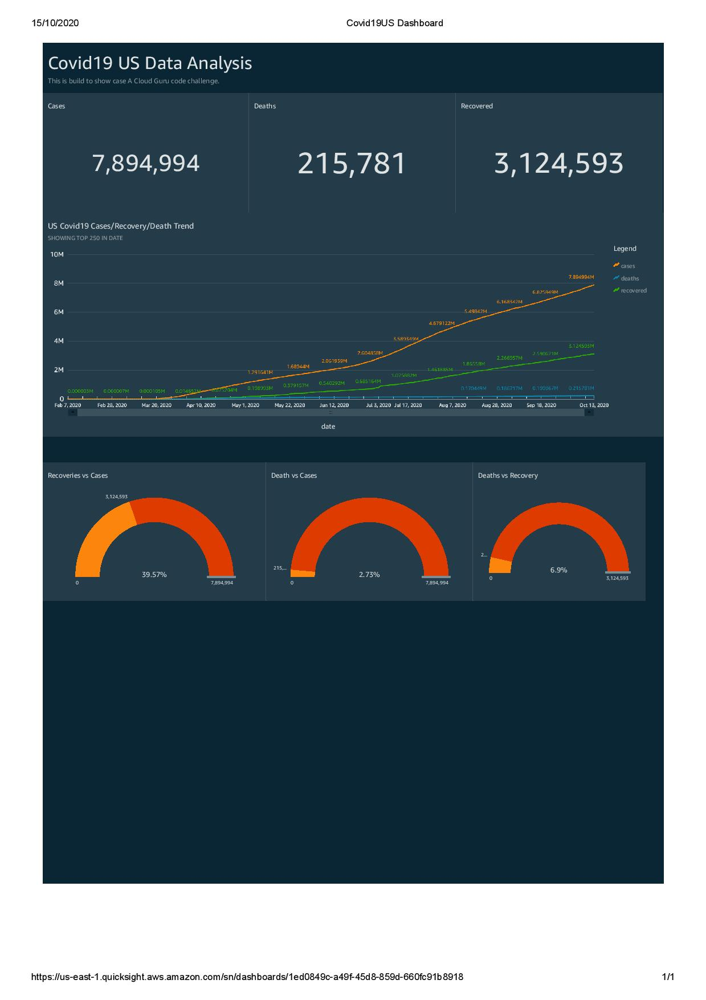

# EventDrivenPythonAWS
This repository is created for creating an event driven Python ETL processing in AWS of COVID-19 US data.

## Prereqisites

1. Create a bucket to store terraform state.

2. Create secrets in Secret Manager. Use secret tye as "Other type of secrets"
    Use these Keys only: username and password

    

## Steps

1. Update backend.tf file with your unique bucket name and you can region as well.

2. Update inputs.tfvar file with your inputs. Use above created secret manager in secret name.

3. Run bellow scripts
```
terraform init

terraform plan

terraform apply -var-file="inputs.tfvars"

```

4. Test failed scenario by updating wrong file name as input. First lambda function will fail to dowloand the file and send email to susbcribed users of ERROR topic.
```
aws lambda invoke \
    --function-name covid19etl-dev-download-lambda \
    --payload '{ "name": "Ankit" }' \
	--region us-east-1 \
    response.json
```
5. You can pass another valid URL but not the same as our source. In this case, our download lambda would be succesfull but ETL lambda will fail and send notification to susbcribed users of ERROR topic.

6. Run below command to trigger DOWNLOAD lambda function manually and then further it will trigger ETL and load data into Database and send notification to susbcribed users of SUCCESS topic.

7. Use buildspec.yml to create AWS Code Build pipeline for deployment.

8. Remember to approve SNS subscription from your mail box.

## Testing
If you want to simulate failiure senario and whether next day it will pick up both failed date data and current day data. Upload files available into "testdata" folder into an S3 public bucket and pass on URLs as  input to lambda function by changing tfvars file and redeploy terraform.
- Test-0 : Input: _day0 files URLs. Deploy using terraform apply. Run lambda invoke AWS CLI. It will load complete data set into DB. 
- Test-1 : Input: _fail files URLs. Deploy using terraform apply. Run lambda invoke AWS CLI. It will fail due to incorrect data.
- Test-2 : Input: _success files URLs. Deploy using terraform apply. Run lambda invoke AWS CLI. It will be successful and both days data will loaded.

**You can have a look of test result available in "test_results.pdf"**

    
## Architecure Diagram


## Dasboard in AWS QuickSights

Follow below link if you are facing issues with accessing database from AWS Quicksight.



https://medium.com/@felipelopezhamann/connect-aws-quicksight-to-an-rds-in-a-vpc-eb1ab1bb539a